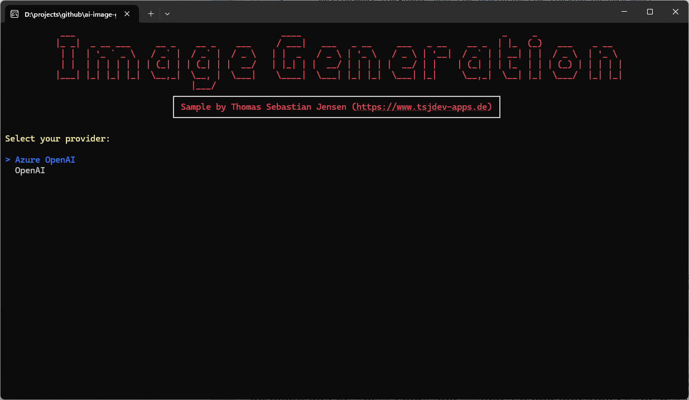
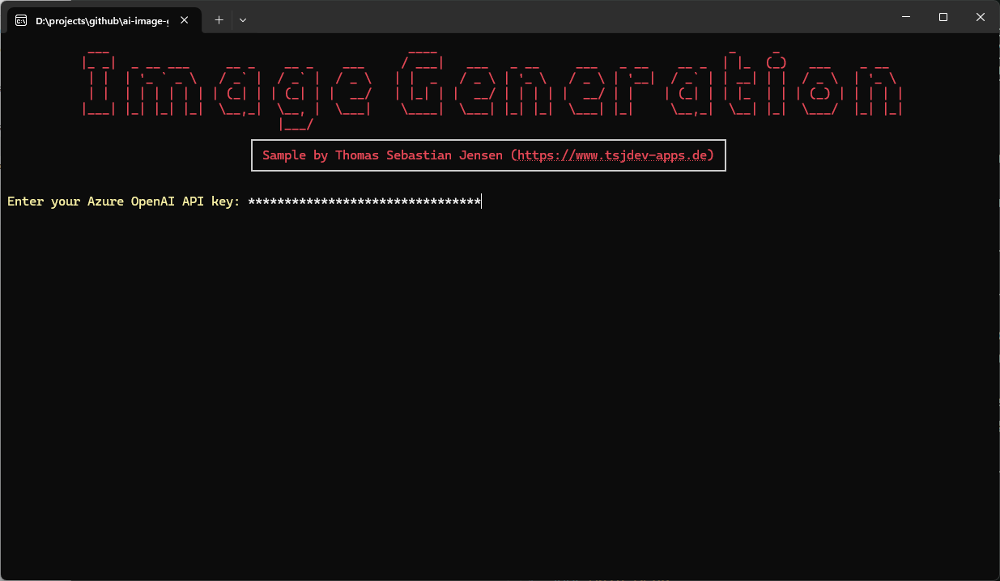
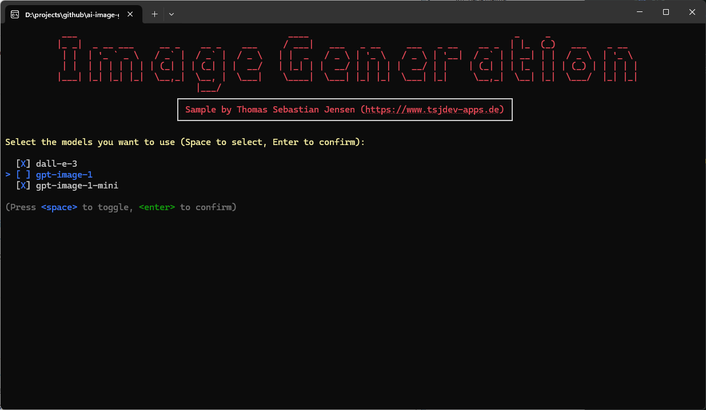
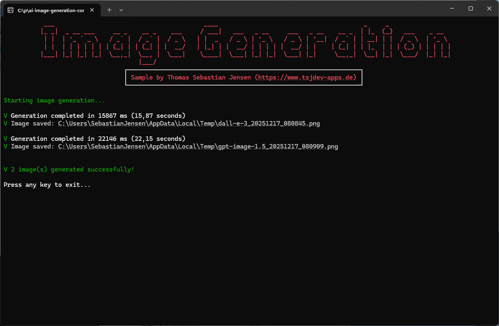

# AI Image Generation Console

A powerful and user-friendly console application for generating images using AI models from **Azure OpenAI**, **OpenAI**, and **Google AI (Gemini)**. Built with .NET 10 and featuring an elegant terminal UI powered by Spectre.Console.


[](https://github.com/tsjdev-apps/ai-image-generation-console/actions/workflows/release.yml)

## ✨ Features

- 🌐 **Multi-Provider Support**: Seamlessly switch between Azure OpenAI, OpenAI, and Google AI (Gemini)
- 🧠 **Multiple Model Support**: Generate images using DALL-E 3, GPT-Image-1, GPT-Image-1-Mini, GPT-Image-1.5, Gemini 2.5 Flash Image, and Gemini 3 Pro Image Preview
- ⚙️ **Customizable Settings**: Configure image size, quality, and style per model
- 💾 **Automatic Saving**: Images are automatically saved to temporary files with timestamps
- ⏱️ **Performance Tracking**: Real-time generation time tracking for each model
- 🎨 **Beautiful UI**: Rich console interface with colors, animations, and clickable file links
- 🔒 **Secure Input**: Masked API key input for security
- 🛡️ **Robust Error Handling**: Graceful handling of API errors with detailed feedback
- 📊 **Generation Summary**: Track success and failure counts across multiple models

## 🖼️ Screenshots

### Main Menu



### Azure OpenAI Configuration



### Model Selection (OpenAI)



### Image Generation Progress



### Generation Results


**DALL-E 3**


**GPT-Image-1.5**

## 🚀 Getting Started

### Prerequisites

- [.NET 10 SDK](https://dotnet.microsoft.com/download/dotnet/10.0) or higher
- An API key from either:
  - [Azure OpenAI Service](https://azure.microsoft.com/en-us/products/ai-foundry/models/openai/)
  - [OpenAI Platform](https://platform.openai.com/)
  - [Google AI (Gemini)](https://ai.google.dev/)

### Installation

1. **Clone the repository**

   ```bash
   git clone https://github.com/tsjdev-apps/ai-image-generation-console.git
   cd ImageGenerationConsole
   ```

1. **Build the project**

   ```bash
   dotnet build
   ```

1. **Run the application**

   ```bash
   dotnet run
   ```

## 🧭 Usage

### Azure OpenAI

1. Select **Azure OpenAI** as your provider
2. Enter your Azure OpenAI endpoint (e.g., `https://your-resource.openai.azure.com/`)
3. Enter your Azure OpenAI API key (input will be masked)
4. Specify your deployments in the format: `deploymentName:modelType`
   - Example: `myDallE:dall-e-3,myGptImage:gpt-image-1`
   - Supported model types:
     - `dall-e-3`
     - `gpt-image-1`
     - `gpt-image-1-mini`
     - `gpt-image-1.5`
5. Enter your image generation prompt
6. Wait for the images to be generated and saved

### OpenAI

1. Select **OpenAI** as your provider
2. Enter your OpenAI API key (input will be masked)
3. Select one or more models using the multi-select menu:
   - Use `Space` to toggle selection
   - Use `Enter` to confirm
4. Enter your image generation prompt
5. Wait for the images to be generated and saved

### Google AI (Gemini)

1. Select **Google AI** as your provider
2. Enter your Google AI API key (input will be masked)
3. Select one or more Gemini image models:
   - `gemini-2.5-flash-image`
   - `gemini-3-pro-image-preview`
4. Enter your image generation prompt
5. Wait for the images to be generated and saved

### Output

Generated images are saved to your system's temporary directory with the following naming convention:

```plaintext
{modelName}_{timestamp}.png
```

Example: `dall-e-3_20240115_143052.png`

The console will display clickable file paths for easy access to the generated images.

## 🧩 Model Configuration

### DALL-E 3

- **Size**: 1792x1024
- **Quality**: Standard
- **Style**: Vivid
- **Format**: URL

### GPT-Image-1

- **Size**: 1536x1024
- **Quality**: High (Azure) / Default (OpenAI)
- **Format**: Bytes (Azure) / Default (OpenAI)

### GPT-Image-1-Mini

- **Size**: 1536x1024
- **Quality**: Medium
- **Format**: Bytes (Azure) / Default (OpenAI)

### GPT-Image-1.5

- **Size**: 1536x1024
- **Quality**: Default
- **Format**: Bytes (Azure) / Default (OpenAI)

## 🏗️ Architecture

The application is structured into three main components:

```plaintext
ImageGenerationConsole/
📄 Program.cs                # Main application logic and orchestration
📂 Helpers/
   📄 ConsoleHelper.cs       # UI utilities using Spectre.Console
   📄 GoogleImageProvider.cs # Google Gemini REST image helper
📂 Utils/
   📄 Statics.cs          ´  # Centralized string constants and messages
```

### Key Design Principles

- 🎯 **Separation of Concerns**: UI, business logic, and constants are well separated
- 🛡️ **Error Resilience**: Comprehensive error handling at every level
- 😊 **User Experience**: Clear prompts, validation, and feedback
- 🧰 **Maintainability**: Centralized strings for easy localization
- 🚀 **Extensibility**: Easy to add new models or providers

## 🧰 Dependencies

- **[Azure.AI.OpenAI](https://www.nuget.org/packages/Azure.AI.OpenAI)**: Azure OpenAI SDK
- **[OpenAI](https://www.nuget.org/packages/OpenAI)**: OpenAI SDK
- **[Spectre.Console](https://www.nuget.org/packages/Spectre.Console)**: Rich console UI framework

## 🩹 Error Handling

The application handles various error scenarios gracefully:

- 🚫 **401 Unauthorized**: Invalid API key
- ⏳ **429 Too Many Requests**: Rate limit exceeded
- 🔎 **404 Not Found**: Model or deployment not found
- 🌐 **Network Errors**: Connection issues during image download
- 🗂️ **File System Errors**: Permission or I/O issues when saving files

## ✍️ Blog Post
If you are more interested into details, please see the following posts on [medium.com](https://medium.com/@tsjdevapps) or in my [personal blog](https://www.tsjdev-apps.de):

- [Building a Multi-Model Image Generation Console App with Azure OpenAI and OpenAI](https://medium.com/medialesson/building-a-multi-model-image-generation-console-app-with-azure-openai-and-openai-fa5b9b790e7e)

## 🤝 Contributing

Contributions are welcome! Please feel free to submit a Pull Request. For major changes, please open an issue first to discuss what you would like to change.

1. Fork the project
2. Create your feature branch (`git checkout -b feature/AmazingFeature`)
3. Commit your changes (`git commit -m 'Add some AmazingFeature'`)
4. Push to the branch (`git push origin feature/AmazingFeature`)
5. Open a Pull Request

## 📜 License

This project is licensed under the MIT License - see the [LICENSE](LICENSE) file for details.
